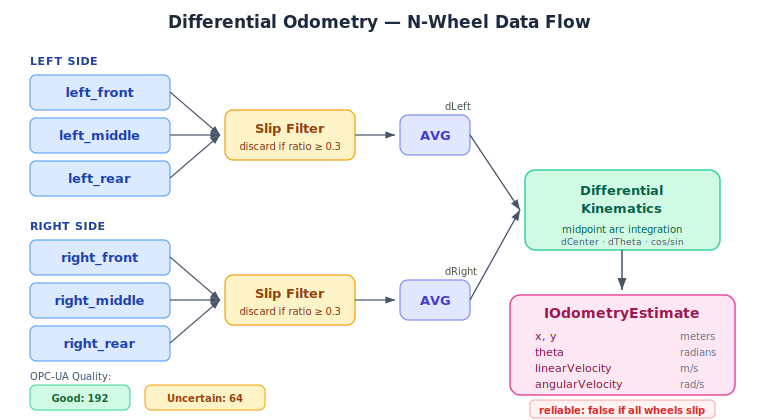

# Differential Odometry

## Overview

The `DifferentialOdometry` class computes a robot's pose (x, y, theta) from
wheel encoder readings using standard differential-drive kinematics. It
supports any number of wheels per side — from a simple 2-wheel robot to a
6-wheel rocker-bogie rover — through per-side slip-filtered averaging.

**Why a deterministic algorithm instead of an MLP?**

Odometry is a solved kinematic problem. The math that converts encoder
ticks to displacement is exact for a given geometry — there is no ambiguity,
no context-dependent decision, and no need for generalization. An MLP would
have to _learn_ trigonometry from data and would learn it worse (approximation
errors, no extrapolation guarantees) with more compute cost.

---

## Algorithm

### Step 1 — Per-side aggregation

For each side (left, right), on every tick:

```
For each wheel on this side:
    1. Read current tick count from encoder
    2. Compute delta ticks since previous frame
    3. Convert to linear displacement: delta × metersPerTick
    4. Check slipRatio against threshold

Filter out slipping wheels (slipRatio ≥ threshold)

If at least one wheel has traction:
    sideDisplacement = average(non-slipping wheel displacements)

If ALL wheels are slipping:
    sideDisplacement = average(all wheel displacements)  ← fallback
    reliable = false                                      ← flag for consumers
```

This filtering is the key to multi-wheel robustness: if a front-left wheel
climbs a rock and loses traction, the middle and rear left wheels compensate.
Only when an entire side loses grip does the estimate degrade.

### Step 2 — Differential-drive kinematics

Once we have a single left/right displacement, the standard equations apply:

```
dCenter = (dLeft + dRight) / 2         ← forward displacement
dTheta  = (dRight − dLeft) / wheelBase ← heading change
```

### Step 3 — Midpoint arc integration

```
midTheta = theta + dTheta / 2

x     += dCenter × cos(midTheta)
y     += dCenter × sin(midTheta)
theta += dTheta
```

**Why midpoint?** Naive integration uses the current `theta` to project
displacement, treating each step as a straight line. Midpoint integration
uses `theta + dTheta/2`, treating each step as a circular arc. This is a
first-order correction that significantly reduces drift on curved paths
at zero extra compute cost.

```
    Naive (straight line)
    ─────────────►  ← overshoots on curves

    ────────╮
            │       Midpoint (arc)
            ╰──────►  ← follows the actual curve
```

### Step 4 — Theta normalization

```
theta = atan2(sin(theta), cos(theta))
```

Keeps heading in [−π, π] to prevent unbounded growth after many rotations.
Without this, floating-point precision degrades over time as theta grows
into the thousands of radians.

### Step 5 — Velocity derivation

```
linearVelocity  = dCenter / dtSec    ← m/s forward
angularVelocity = dTheta  / dtSec    ← rad/s turning rate
```

---

## Slip Detection

The odometry node does **not** compute slip ratios — that is the
responsibility of each `IWheelEncoderNode`. The odometry node **consumes**
the slip information in two ways:

1. **Per-wheel filtering**: wheels with `slipRatio ≥ slipThreshold` are
   excluded from the side average, so a single spinning wheel doesn't
   corrupt the estimate.

2. **Reliability flag**: if all wheels on either side are slipping,
   the estimate is tagged `reliable = false`. Downstream consumers
   (state fusion EKF, navigation brain) should down-weight or discard it.

The `slipThreshold` default of 0.3 means a wheel must lose 30% of its
expected traction before being excluded. This avoids over-filtering on
rough terrain where minor slip is normal.

---

## Wheel Labelling Convention

Wheels are assigned to a side by their `label` prefix (case-insensitive):

| Label            | Side  |
| ---------------- | ----- |
| `"left"`         | Left  |
| `"left_front"`   | Left  |
| `"left_middle"`  | Left  |
| `"left_rear"`    | Left  |
| `"right"`        | Right |
| `"right_front"`  | Right |
| `"right_middle"` | Right |
| `"right_rear"`   | Right |

Labels that don't start with `"left"` or `"right"` are silently ignored —
they don't contribute to differential-drive kinematics (e.g., a center
caster wheel).

At least one wheel per side is required. The constructor throws if this
constraint is violated.

---

## Configuration Examples

### 2-wheel differential drive

```typescript
const odometry = new DifferentialOdometry(
    [
        { label: "left", encoder: leftEncoder },
        { label: "right", encoder: rightEncoder },
    ],
    0.3, // wheelBase: 30cm between wheels
    0.3 // slipThreshold
);
```

### 4-wheel skid-steer

```typescript
const odometry = new DifferentialOdometry(
    [
        { label: "left_front", encoder: lfEncoder },
        { label: "left_rear", encoder: lrEncoder },
        { label: "right_front", encoder: rfEncoder },
        { label: "right_rear", encoder: rrEncoder },
    ],
    0.45 // wheelBase: 45cm between left/right tracks
);
```

### 6-wheel rover (rocker-bogie)

```typescript
const odometry = new DifferentialOdometry(
    [
        { label: "left_front", encoder: lfEncoder },
        { label: "left_middle", encoder: lmEncoder },
        { label: "left_rear", encoder: lrEncoder },
        { label: "right_front", encoder: rfEncoder },
        { label: "right_middle", encoder: rmEncoder },
        { label: "right_rear", encoder: rrEncoder },
    ],
    0.6, // wheelBase: 60cm between left/right tracks
    0.3 // slipThreshold
);
```

---

## Data Flow



### Quality tagging

The emitted `IOdometryEvent` carries OPC-UA style quality flags:

| Condition                             | Quality     | Value |
| ------------------------------------- | ----------- | ----- |
| All contributing wheels have traction | `Good`      | 192   |
| Any side has all wheels slipping      | `Uncertain` | 64    |

---

## Integration with Navigation Architecture

The odometry estimate feeds into the navigation pipeline at two levels:

1. **State fusion** — the `IOdometryEstimate` is one of four inputs
   (alongside IMU, LiDAR, and raw wheel data) that the state fusion
   step combines into the `INavigatorInputTensor`. The `reliable` flag
   controls how much weight the fuser gives to this source vs the IMU.

2. **MLP-Decide input** — the fused pose (x, y, theta, vx, vy, omega)
   occupies indices [8..13] of the decision MLP's 21-float input vector,
   alongside the 8 learned features from MLP-Percept, wheel slip ratios,
   and the goal vector. When odometry is unreliable, the fuser leans more
   on IMU integration, which drifts faster but isn't affected by wheel slip.

3. **Wheel slip → MLP-Decide** — per-wheel slip ratios occupy indices
   [14..17] of the decision input. The decision MLP can learn to reduce
   throttle or increase braking when slip is high, complementing the
   odometry's `reliable` flag.

See [Navigation Architecture](./navigation-architecture.md) for the
full cascaded two-tier brain design.

---

## Assumptions and Limitations

- **Planar motion only**: no pitch/roll compensation. On steep slopes,
  the effective wheel radius changes and the 2D projection introduces
  error. For rough terrain, fuse with IMU tilt data.

- **Symmetric track width**: all wheels are assumed to be at the same
  lateral offset from center. Ackermann-steered front wheels with
  different track widths would need a more complex kinematic model.

- **No individual wheel steering**: this is a skid-steer / differential
  model. Explicit steering angles (e.g., car-like Ackermann) require a
  different odometry formulation.

- **Encoder drift**: tick counts are integers, so very slow motion can
  produce zero-delta frames. This is inherent to encoder resolution and
  not a bug — higher `ticksPerRevolution` encoders reduce this effect.
