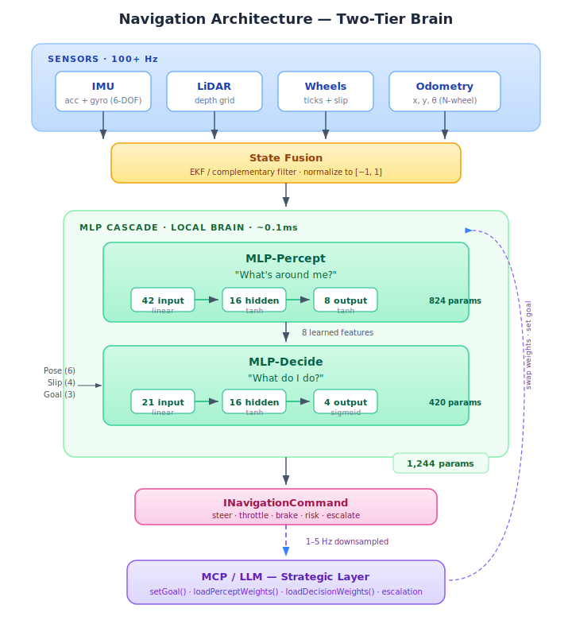
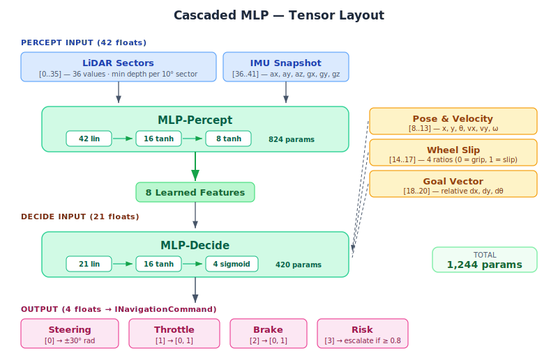

# Navigation Architecture

## Overview

The navigation system follows a **two-tier brain architecture** that separates
fast reactive control from slow strategic reasoning. This design mirrors
biological nervous systems: a spinal reflex arc (MLP cascade) handles
millisecond motor responses, while a cortex (MCP/LLM) handles planning
and adaptation.



---

## Tier 1 — Perception & Reactive Control

### Sensor Layer

Four sensor types feed the navigation pipeline, all running at high
frequency (100+ Hz) within the simulation tick loop:

| Sensor             | Interface                   | Output                                      | Rate        | Role                                        |
| ------------------ | --------------------------- | ------------------------------------------- | ----------- | ------------------------------------------- |
| **IMU**            | `IIMU6Node`                 | `ICartesian3` (acc + gyro)                  | 100–1000 Hz | Short-term ego-motion, tilt, fall detection |
| **Stereo**         | `IStereoNode`               | `IStereoScanResult` (dense depth + confidence) | 10–30 Hz | Primary depth (day), passive, low power     |
| **LiDAR**          | `ILidarNode`                | `ILidarScanResult` (depth grid)             | 10–30 Hz    | Backup depth (night/precision), active      |
| **Depth Fusion**   | `DepthFusionNode`           | `IFusedDepthResult` (sectors + source)      | 10–30 Hz    | Selects best depth source automatically     |
| **Wheel Encoders** | `IWheelEncoderNode`         | `IWheelEncoderData` (ticks, velocity, slip) | 100+ Hz     | Ground-truth speed, traction monitoring     |
| **Odometry**       | `IDifferentialOdometryNode` | `IOdometryEstimate` (x, y, theta)           | 100+ Hz     | Dead-reckoning pose estimate                |

Every sensor implements `ISensorNode` — it participates in the `ISimSpace`
graph and receives `onTick(dtMs)` calls each frame. Sensors expose two
consumption patterns:

- **Pull**: `sensorRead()` returns the latest value synchronously (used by
  the state fusion step inside the tick loop).
- **Push**: `onSensorEvent(callback)` emits batched records asynchronously
  (used by telemetry loggers and the MCP layer).

### Depth Fusion — Stereo + LiDAR

The primary depth source is **stereoscopic vision** (two passive cameras),
not LiDAR. This mirrors real Mars rovers: NavCams (stereo) handle daily
navigation at low power; LiDAR is reserved for night operations and precise
geological surveys.

The `DepthFusionNode` automatically selects the best source:
- **Day + good texture** → stereo (passive, low power, dense depth)
- **Night / textureless / stereo unhealthy** → LiDAR (active, reliable)

Both sources produce an `IDepthBuffer` through the same pipeline, so the
PerceptCortex is depth-source-agnostic.

See [stereo-vision.md](./stereo-vision.md) for the matching algorithms,
failure modes, noise characteristics, and trade-offs vs LiDAR.

### State Fusion

Raw sensor readings drift and disagree. The state fusion step combines
them into a single, confidence-weighted estimate:

- **IMU** provides high-frequency but drift-prone angular/linear rates.
- **Odometry** provides medium-frequency ground-truth but accumulates
  integration error over time.
- **Stereo / LiDAR** depth can correct drift via scan matching (comparing
  successive depth frames against the estimated pose).
- **Stereo confidence** from the fusion node signals when depth data should
  be down-weighted (textureless terrain, low light).
- **Wheel slip** flags from the encoders signal when odometry should be
  down-weighted (the `reliable` flag on `IOdometryEstimate` feeds into
  the confidence weighting).

---

### Cascaded MLP — The Local Brain

The `NavigatorBrain` uses a **two-stage cascaded MLP** instead of a
single monolithic network. Each stage has a distinct responsibility:



**Total trainable parameters**: 824 + 420 = **1,244**

#### Stage 1 — MLP-Percept (Perception)

| Property   | Value                       | Rationale                                                                            |
| ---------- | --------------------------- | ------------------------------------------------------------------------------------ |
| Input      | 42 neurons, linear          | LiDAR (36) + IMU (6), pass-through                                                   |
| Hidden     | 16 neurons, tanh            | Symmetric [−1,+1], learns obstacle features                                          |
| Output     | 8 neurons, tanh             | Learned features in [−1,+1] (not sigmoid — intermediate values need symmetric range) |
| Parameters | 42×16 + 16×8 + 16 + 8 = 824 |                                                                                      |

MLP-Percept answers the question "what's around me?" by compressing 42 raw
spatial inputs into 8 meaningful features. These features are **not
hand-designed** — the network learns to encode them during training or
evolution. Conceptually, they converge toward signals like:

#### Formal Definition of the 8 Perception Outputs

Each output neuron has a precise definition, numeric range, and a computable
ground truth used to build supervised training sets. During end-to-end
evolutionary training the features may drift from these definitions toward
whatever representation best serves the decision cortex.

| Index | Name                     | Range          | Definition                                                                                                    |
| ----- | ------------------------ | -------------- | ------------------------------------------------------------------------------------------------------------- |
| 0     | `frontObstacleProximity` | 0.0 → 1.0     | How close the nearest front obstacle is. 0 = nothing within maxRange, 1 = contact.                            |
| 1     | `frontObstacleBearing`   | −1.0 → +1.0   | Angular position of the nearest front obstacle. −1 = hard left, 0 = dead center, +1 = hard right.            |
| 2     | `leftClearance`          | 0.0 → 1.0     | Average free space on the left side. 0 = wall, 1 = wide open.                                                |
| 3     | `rightClearance`         | 0.0 → 1.0     | Average free space on the right side. 0 = wall, 1 = wide open.                                               |
| 4     | `closingRate`            | −1.0 → +1.0   | Rate of approach to the nearest front obstacle. −1 = approaching fast, 0 = static, +1 = receding.            |
| 5     | `corridorDirection`      | −1.0 → +1.0   | Direction of the most open corridor. −1 = best path is hard left, 0 = straight, +1 = hard right.             |
| 6     | `terrainRoughness`       | 0.0 → 1.0     | Vibration intensity from IMU. 0 = smooth surface, 1 = very rough terrain.                                     |
| 7     | `confidence`             | 0.0 → 1.0     | Overall reliability of the perception reading. 0 = unreliable (noisy/contradictory), 1 = high trust.          |

**Ground truth computations** (used to generate supervised training labels):

```
# Sector layout: 36 LiDAR sectors spanning the horizontal FOV
# Sectors 0–8: left quadrant, 9–17: front-left, 18–26: front-right, 27–35: right quadrant
# "Front sectors" = sectors 9–26 (central 180°)
# "Left sectors"  = sectors 0–8
# "Right sectors" = sectors 27–35

[0] frontObstacleProximity:
    minFront = min(depth[9..26])
    output   = clamp(1.0 − minFront / maxRange, 0, 1)

[1] frontObstacleBearing:
    For each front sector i in [9..26] where depth[i] < threshold:
        accumulate weighted angle: sum += angle[i] × (1 / depth[i])
        accumulate weight:        w   += (1 / depth[i])
    centroid = sum / w                        (angular centroid of close obstacles)
    output   = clamp(centroid / halfFov, −1, +1)  (normalize to [−1, +1])

[2] leftClearance:
    output = clamp(mean(depth[0..8]) / maxRange, 0, 1)

[3] rightClearance:
    output = clamp(mean(depth[27..35]) / maxRange, 0, 1)

[4] closingRate:
    Method A (IMU-based):  dot(linearAccel, forwardUnitVector) / maxAccel
    Method B (depth-based): (prevMinFrontDepth − currMinFrontDepth) / (dt × maxSpeed)
    output = clamp(value, −1, +1)   (negative = closing, positive = receding)

[5] corridorDirection:
    bestSector = argmax(depth[0..35])    (sector with deepest reading)
    bestAngle  = angle[bestSector]        (angular direction of that sector)
    output     = clamp(bestAngle / halfFov, −1, +1)

[6] terrainRoughness:
    window = last N IMU acceleration samples (e.g., N = 10)
    variance = var(‖accel‖ for each sample in window)
    output   = clamp(variance / maxVariance, 0, 1)

[7] confidence:
    Factors that reduce confidence:
      − High variance across adjacent LiDAR sectors (noisy returns)
      − IMU readings near sensor limits (saturated accelerometer)
      − Large discrepancy between IMU-derived motion and encoder-derived motion
    output = 1.0 − clamp(combined_noise_score, 0, 1)
```

**Activation function note:** The perception outputs use **tanh** (range
[−1, +1]), which covers outputs 1, 4, and 5 naturally. Outputs 0, 2, 3, 6,
and 7 are defined in [0, 1] — during supervised training the labels are
remapped to [0, +1] which is the positive half of tanh's range. The network
learns to stay in the appropriate half.

#### Training Strategy

The percept cortex is trained in three phases:

1. **Phase 1 — Supervised pre-training**: Generate thousands of synthetic
   scenarios (random obstacle layouts, rover poses, terrain types). Compute
   the 8 labels using the ground truth formulas above. Train with MSE loss
   to approximate them. This gives a **working starting point** — the cortex
   can already "see."

2. **Phase 2 — End-to-end evolutionary training**: Both cortexes evolve
   together using a fitness function (reach goal, avoid collisions, minimize
   time). The percept features drift from the exact algorithmic definitions
   toward whatever representation best helps navigation. This is the same
   mutation-based approach used in `CreatureBrain`.

3. **Phase 3 — MCP strategic override**: The LLM layer monitors fitness,
   confidence, and slip status. It can trigger weight reloads, parameter
   adjustments, or goal changes at any time.

#### Stage 2 — MLP-Decide (Decision)

| Property   | Value                       | Rationale                                     |
| ---------- | --------------------------- | --------------------------------------------- |
| Input      | 21 neurons, linear          | Features (8) + pose (6) + slip (4) + goal (3) |
| Hidden     | 16 neurons, tanh            | Symmetric, learns control policy              |
| Output     | 4 neurons, sigmoid          | Bounded [0,1] for motor commands              |
| Parameters | 21×16 + 16×4 + 16 + 4 = 420 |                                               |

MLP-Decide answers "what do I do?" by mapping the clean perception features
plus ego-state and goal to motor commands. It receives a much cleaner signal
than raw depth data — 8 learned features instead of 36 noisy depth sectors.

**Output mapping:**

| Index | Signal   | Sigmoid range  | Physical mapping                   |
| ----- | -------- | -------------- | ---------------------------------- |
| 0     | Steering | 0.5 = straight | [−π/6, +π/6] radians (±30°)        |
| 1     | Throttle | 0 = stopped    | [0, 1] forward force ratio         |
| 2     | Brake    | 0 = coasting   | [0, 1] braking force ratio         |
| 3     | Risk     | 0 = safe       | When ≥ threshold → escalate to MCP |

#### Why Cascaded Instead of Monolithic?

The original design used a single 55→32→4 MLP (1,924 params) that handled
both perception and decision in one network. The cascaded design improves
on this in four ways:

1. **Learned features > raw depth**: MLP-Percept compresses 36 depth sectors
   into 8 meaningful signals. The decision network gets a much cleaner input.

2. **Each MLP stays small and trainable**: 824 + 420 = 1,244 total params
   (vs 1,924). Fewer parameters per network means faster convergence during
   training/evolution and less overfitting.

3. **Independent training/evolution**: Perception can be trained on "label
   the obstacles" tasks, then frozen while the decision MLP evolves on
   "reach the goal" tasks. Or swap perception models for different sensor
   configs (e.g., 16-beam vs 64-beam LiDAR) without retraining the
   control policy.

4. **Interpretable intermediate layer**: The 8 percept outputs are loggable,
   visualizable features. "Why did it turn left?" → inspect the percept
   output vector, not 36 raw depth sectors.

#### Design Choices

- **Why tanh on MLP-Percept output?** These are intermediate values fed
  into MLP-Decide, not final motor commands. Symmetric [−1,+1] range
  preserves directional information ("obstacle left" = negative,
  "obstacle right" = positive). Sigmoid would squash this into [0,1],
  losing the sign-based directional encoding.

- **Why sigmoid on MLP-Decide output?** Motor commands are inherently
  bounded and positive. Steering maps from [0,1] to [−30°,+30°] with 0.5
  as center. Throttle and brake are force ratios in [0,1]. Risk is a
  probability-like score.

- **Why not deeper?** Each MLP uses a single hidden layer. For the reactive
  mappings needed (weighted sums of distances, angles, and features), one
  hidden layer provides enough capacity. More layers would add latency and
  make evolutionary mutation less effective — changes in early layers get
  diluted through multiple non-linearities.

- **Why Glorot initialization?** Scales initial weights by
  `sqrt(2 / (fan_in + fan_out))`, keeping activations from saturating
  at generation 0. This gives mutation a reasonable starting distribution.

---

## Tier 2 — Strategic Layer (MCP / LLM)

The MCP layer operates at a much lower cadence (1–5 Hz). It does **not**
drive motors directly — it sets intent that Tier 1 executes reactively.

### Responsibilities

| Capability                  | Mechanism                                                                                                                                  |
| --------------------------- | ------------------------------------------------------------------------------------------------------------------------------------------ |
| **Set navigation goals**    | `setGoal(INavigatorGoal)` — push a waypoint into the decision MLP input tensor                                                             |
| **Swap perception weights** | `loadPerceptWeights(uri)` — switch obstacle detection models for different environments (indoor vs outdoor, dense vs sparse)               |
| **Swap decision weights**   | `loadDecisionWeights(uri)` — switch control policies (road vs off-road, calm vs aggressive)                                                |
| **Handle escalations**      | Monitor the MLP-Decide `risk` output; when `escalate = true`, reason about alternatives                                                    |
| **Inspect perception**      | Read `lastPerceptFeatures` to understand what the perception MLP "sees" — enables LLM-level reasoning about the spatial situation          |
| **Contextual reasoning**    | Use LLM capabilities for scenarios that a 1,244-parameter cascade cannot handle (construction zones, traffic signals, ambiguous obstacles) |

### Weight Loading

The `IWeightLoader` interface decouples weight storage from both brains:

```typescript
interface IWeightLoader {
    load(uri: string): Promise<{ weights: number[]; biases: number[] }>;
}
```

Implementations can load from any transport (file system, HTTP, IndexedDB)
and any format (JSON, binary, protobuf). The weight loader is shared by
both MLPs but each maintains independent weight sets.

When weights are loaded into either sub-brain:

1. Synapse weights and neuron biases are applied to the `IMlpGraph`.
2. The `MLPInferenceRuntime` is recompiled to reflect the new parameters.
3. The next `onTick()` uses the updated brain immediately — no downtime.

### Escalation Flow

```
MLP-Decide output: risk = 0.92 (≥ threshold 0.8)
    │
    ▼
INavigationCommand.escalate = true
    │
    ▼
MCP layer receives notification (via sensor event at 1–5 Hz)
    │
    ├── Read lastPerceptFeatures: [0.9, -0.3, 0.1, ...] → "large obstacle front-right"
    ├── Reason about alternatives
    └── Decision:
        ├── setGoal(newWaypoint)              → reroute around obstacle
        ├── loadPerceptWeights("indoor-v2")   → switch to indoor obstacle model
        ├── loadDecisionWeights("off-road")   → switch to terrain-adapted policy
        └── emergencyStop()                   → halt and request human input
```

---

## Module Structure

```
packages/dev/core/src/
│
├── telemetry/                  Data flow & quality model
│   ├── dataflow.interfaces.ts    IIndexed, ITimed, ISequenceable
│   ├── telemetry.interfaces.ts   IRecord, ITimeSerie, ISample, QualityLevel
│   └── index.ts
│
├── simulation/                 Tick loop & graph
│   ├── sim.interfaces.ts         ISimNode, ISimSpace
│   └── index.ts
│
├── perception/                 Sensor abstractions
│   └── sensors/
│       ├── sensors.interfaces.ts           ISensor, ISensorReadable, ISensorWritable,
│       │                                   ISensorEventEmitter, ISensorNode
│       ├── sensors.imu.interfaces.ts       IAccelerometerNode, IGyroNode, IIMU6Node
│       ├── sensors.lidar.interfaces.ts     ILidarScanOptions, ILidarScanResult, ILidarNode
│       ├── sensors.wheel-encoder.interfaces.ts  IWheelEncoderNode, IDifferentialOdometryNode
│       ├── sensors.differential-odometry.ts     DifferentialOdometry (N-wheel impl)
│       └── index.ts
│
├── navigation/                 Cascaded MLP brain & command output
│   ├── navigation.interfaces.ts  IPerceptBrain, IDecisionBrain,
│   │                             INavigatorBrain, INavigatorInputTensor,
│   │                             INavigationCommand, IWeightLoader,
│   │                             INavigatorBrainOptions, INavigatorNode
│   ├── navigation.brain.ts       PerceptBrain (42→16→8),
│   │                             DecisionBrain (21→16→4),
│   │                             NavigatorBrain (cascaded)
│   └── index.ts
│
└── index.ts                    Re-exports all modules
```

---

## Interface Dependency Graph

```
@spiky-panda/core
    │
    ├── INode, IGraph, IOlink ──────► ISimNode, ISimSpace
    │                                     │
    ├── IIDentifiable, IDisposable ──► ISensor
    │                                     │
    ├── ICartesian3 ────────────────► IAccelerometerNode, IGyroNode
    │                                     │
    ├── IMlpGraph, MLPInferenceRuntime ──► IPerceptBrain, IDecisionBrain
    │                                     │
    └── PerceptronBuilder, Glorot... ──► PerceptBrain, DecisionBrain (impls)

@dev/core/telemetry
    │
    └── IRecord ────────────────────► ISensorEventEmitter<TEvent>
                                      │
                                      ├── IAccelerometerEvent
                                      ├── IGyroEvent
                                      ├── ILidarEvent
                                      ├── IWheelEncoderEvent
                                      ├── IOdometryEvent
                                      └── INavigationCommandEvent

@dev/core/perception
    │
    ├── ISensorNode ────────────────► IIMU6Node
    ├── ISensorNode ────────────────► ILidarNode
    ├── ISensorNode ────────────────► IWheelEncoderNode
    ├── ISensorNode ────────────────► IDifferentialOdometryNode
    └── ISensorNode ────────────────► INavigatorNode

@dev/core/navigation
    │
    ├── IPerceptBrain ◄──────────── PerceptBrain (42→16→8)
    ├── IDecisionBrain ◄─────────── DecisionBrain (21→16→4)
    ├── INavigatorBrain ◄────────── NavigatorBrain (cascade)
    ├── IWeightLoader ◄──────────── (user-provided impl)
    └── INavigatorNode ─── consumes ──► IMU + LiDAR + Wheels + Odometry
                       └── produces ──► INavigationCommand
```

---

## Data Flow Summary

1. **Sensors** produce raw readings every tick (`onTick(dtMs)`).
2. **State fusion** normalizes and combines them into structured tensors.
3. **MLP-Percept** compresses LiDAR (36) + IMU (6) → 8 learned features (~0.05ms).
4. **MLP-Decide** maps features (8) + pose (6) + slip (4) + goal (3) → 4 motor outputs (~0.05ms).
5. **`INavigationCommand`** is emitted as a sensor event for actuators.
6. **MCP layer** (1–5 Hz) monitors risk, inspects percept features, sets goals, swaps weights.

The critical invariant: **Tier 1 never waits for Tier 2.** The MLP cascade
always produces a valid command from the latest sensor state. The MCP layer
influences behavior asynchronously by:

- Adjusting the goal vector (takes effect next tick)
- Swapping percept weights (changes what features the network "sees")
- Swapping decision weights (changes the control policy)

None of these operations block the control loop.

---

## Parameter Budget Comparison

| Architecture                       | Weights | Biases | Total | Inference |
| ---------------------------------- | ------- | ------ | ----- | --------- |
| **Monolithic** 55→32→4             | 1,888   | 36     | 1,924 | ~0.1ms    |
| **Cascaded** [42→16→8] + [21→16→4] | 1,200   | 44     | 1,244 | ~0.1ms    |

The cascaded design uses **35% fewer parameters** while providing better
separation of concerns, independent trainability, and interpretable
intermediate features.
